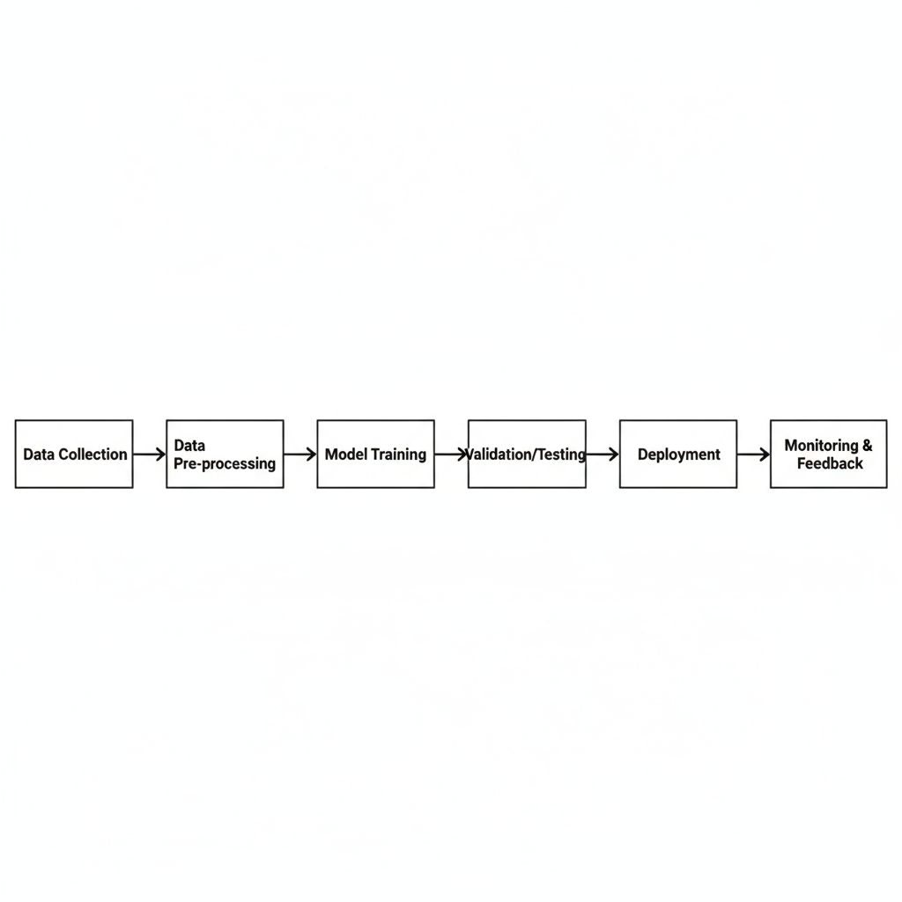

# AI Fundamentals & Workflow

This project summarizes my learnings from AI fundamentals courses (Elements of AI, AI for Everyone, Google AI Essentials).  
It explains what AI is, key concepts, and provides a simple workflow diagram.

## Key Learnings
- What Artificial Intelligence is and is not
- Machine Learning vs. Deep Learning
- Types of AI (Narrow AI, General AI)
- Examples of AI applications in healthcare, compliance, and business

## Workflow Diagram
The diagram below shows a basic AI workflow: data collection → model training → validation → deployment → monitoring.

## Why This Matters for Compliance
Understanding the AI lifecycle helps identify risks, regulatory checkpoints, and where governance policies apply.
